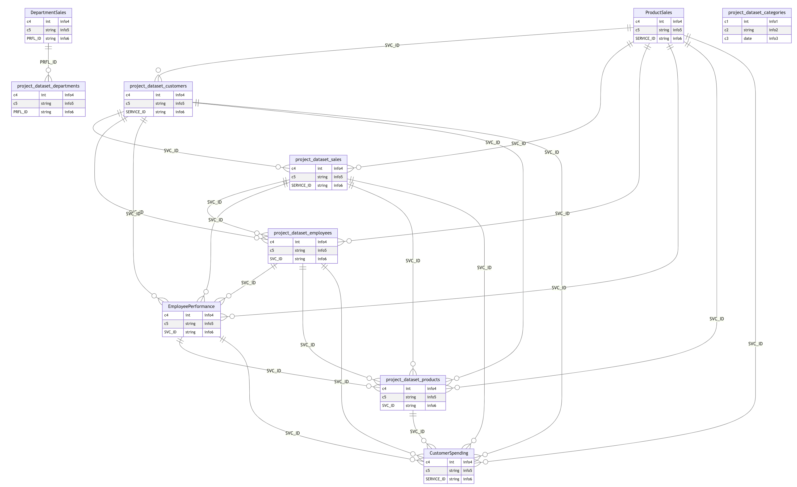

# Parse Queires to gerenate ER Diagram

Sometimes, there are a bunch of SQL queries but don't exist ER Diagram. In this case, tracking table's relations and columns are difficult. This project helps to generate Entity Relationship Diagram, so called ER Diagram or ERD with some quries. Of course, queries doesn't show all the relationships between tables, so you can handle custom modification with this project.

## Sample Result
[output/mermaid_result.html](output/mermaid_result.html)

## Preparation and Installation

* > Python3.8
* `pip install -r requirements.txt`

* Google's BigQuery is ONLY allowed for now.

* You need schemas of each tables. modify `get_schema_from_table_name` function in [parse.py](parse.py)
* Modify [relations.json](relations.json). each list has alternative names of columns.
* prepare your own quries in [queries](queries)

## RUN

`python main.py`

## TODOs

- [ ] Generalize bigquery to all sql queries
- [ ] Mermaid to interactive UI (Implement Airflow's dag dependancy-like graph)